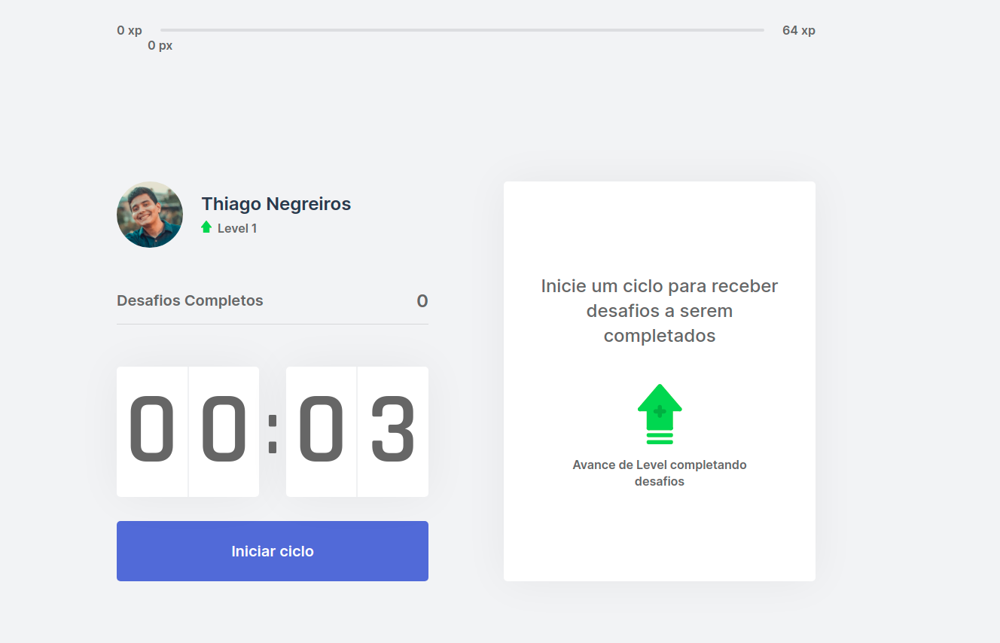

# Moveit

## Projeto criado como parte da Semana NLW-4 Rocketseat

Esse projeto tem o intuito de fazer um contdown e mostrar após uma base de dados em .JSON



## Para fazer o build na máquina.

1 . Você deve baixar o projeto do github para a sua máquina.

2 . Abrir o terminal e digitar o seguinte comando

```bash
yarn install && yarn dev
```

Ou

```bash
npm run install && npm run dev
```
